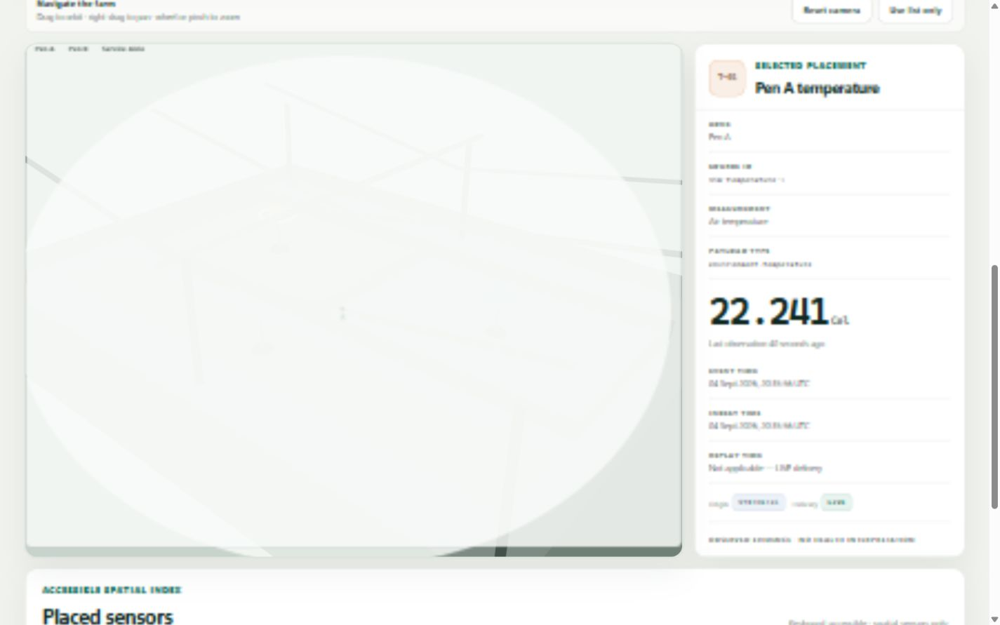

# PigWatch Dashboard and Digital Farm

The application combines the M3 read-only React/TypeScript telemetry console with the M4 browser
Digital Farm. The telemetry view displays API and ingestion readiness, the newest bounded
observation window, latest readings, independent origin/delivery provenance, filters, factual
detail, and discrete historical points. The farm maps the existing development source IDs to local
spatial presentation metadata. Neither view interprets animal or environmental health.

## Run locally

Start PostgreSQL, MQTT, and the API, then run Vite from the repository root:

```bash
docker compose up -d --wait postgres mqtt api
npm run dev --workspace @pigwatch/dashboard
```

Open `http://127.0.0.1:5173`. Vite proxies `/api` to `http://127.0.0.1:8000`.

To produce the M2 development readings after `/health/ready` succeeds:

```bash
uv run pigwatch-simulator --config configs/simulator.development.json
```

Alternatively, build and run the full stack:

```bash
docker compose up --build
```

The Nginx dashboard image proxies `/api` to the Compose API service. The browser never connects to
PostgreSQL or MQTT.

## Digital Farm



Choose **Digital Farm** in the header. The canonical layout is `src/digital-farm/layout.ts` and
places:

| Source ID | Measurement | Zone | Coordinates in meters |
| --- | --- | --- | --- |
| `sim-temperature-1` | Air temperature | Pen A | `(-8, 2.2, -2)` |
| `sim-humidity-1` | Relative humidity | Pen B | `(8, 2.2, -2)` |
| `sim-nh3-1` | NH3 concentration | Service Aisle | `(0, 2.2, 7)` |

The origin is the shed-floor center, `+x` is east/right, `+y` is up, `+z` is the service/front
direction, and one world unit is one meter. Drag to orbit, right-drag to pan, use the wheel or pinch
to zoom, and choose **Reset camera** for the canonical view. Marker and textual-card selection share
one selected source ID.

The scene uses the existing M3 `useTelemetry` result; it has no fetch, MQTT, or database access.
The sensor directory and factual detail are always normal HTML. They remain usable when WebGL is
unsupported, hidden with **Use list only**, context-lost, or unable to render. Unplaced API sources
remain in the M3 Telemetry view.

The layout types and validation are an M4-local development contract only. They are not exported,
persisted, or promised to later milestones, so M4 does not introduce a new shared spatial schema or
ADR. A persistent or cross-service facility model needs a future architecture decision.

## 3D dependencies and budget

The locked M4 dependency set is:

| Package | Locked version | Purpose | License |
| --- | --- | --- | --- |
| `three` | 0.185.1 | WebGL scene, materials, geometry, and OrbitControls | MIT |
| `@react-three/fiber` | 9.7.0 | React ownership and demand-based Three.js rendering | MIT |
| `@types/three` | 0.185.4 | TypeScript declarations used only at build/test time | MIT |

No Drei, physics engine, game engine, remote runtime asset, or paid service is used. Vite
tree-shakes application imports and splits the scene/dependencies behind the Digital Farm view.
The validated production build produces a 74.77 KiB gzip initial application chunk, a 4.35 KiB
increase from the 70.42 KiB M3 base, and a 246.13 KiB gzip lazy 3D chunk. The canonical scene stays
below 12,000 triangles, 45 draw calls, and four lights by construction; pixel ratio is capped at
1.5 and `frameloop="demand"` avoids idle rendering.
The small scene preserves its WebGL drawing buffer for reliable visual QA and screenshot capture;
this does not schedule frames while the view is idle.

## Configuration

Vite configuration is embedded at build time:

| Variable | Default | Constraint |
| --- | --- | --- |
| `VITE_PIGWATCH_API_BASE_URL` | `/api` | Relative proxy path is recommended locally |
| `VITE_PIGWATCH_OBSERVATION_LIMIT` | `200` | 1 through the API maximum of 500 |
| `VITE_PIGWATCH_POLL_INTERVAL_MS` | `10000` | 1,000 through 300,000 ms |
| `VITE_PIGWATCH_STALE_AFTER_MS` | `60000` | 10,000 through 86,400,000 ms |

Invalid numeric configuration falls back to its documented default. Polling waits for each cycle
to settle before scheduling the next, pauses scheduled requests while the page is hidden, and
aborts active requests on unmount. Manual refresh is available from the header.

Each health endpoint reports the outcome of its current request. If readiness cannot be refreshed,
previous dependency evidence is retained only under an explicit “Last known” label; dependencies
with no successful readiness response are “Unknown.” A liveness request failure is shown as current
API unavailability. Observation refresh failures do not erase previously loaded telemetry.

Observation responses are rejected if their item count exceeds the requested bound or the API
maximum of 500. Event, ingest, and replay timestamps must be timezone-aware RFC 3339 values. Very
large and very small finite measurements use bounded scientific notation in the UI while the
detail panel preserves the JavaScript machine representation and unit.

The stale indication is an operator-dashboard freshness policy based on the newest loaded event
time and browser clock. It is not a health or biological threshold.

## Filters and evidence window

Source, measurement, and time filters run in the browser over the newest bounded result returned by
the API. “All loaded” means that bounded result, not the complete database history. Reset filters
restores all sources, all measurements, and the entire loaded window.

Origin (`SYNTHETIC`/`PHYSICAL`) and delivery (`LIVE`/`RECORDED`) are displayed as separate labels in
reading cards, observation rows, and detail. Recorded evidence displays replay time; live evidence
states that replay time is not applicable.

## Validation

From the repository root:

```bash
npm run typecheck --workspace @pigwatch/dashboard
npm run test --workspace @pigwatch/dashboard
npm run build --workspace @pigwatch/dashboard
```

See [`docs/specs/m3-basic-dashboard.md`](../../docs/specs/m3-basic-dashboard.md) and
[`docs/known-limitations/m3.md`](../../docs/known-limitations/m3.md) for the complete behavior and
limits. M4 behavior and constraints are in
[`docs/specs/m4-interactive-digital-farm.md`](../../docs/specs/m4-interactive-digital-farm.md) and
[`docs/known-limitations/m4.md`](../../docs/known-limitations/m4.md).
